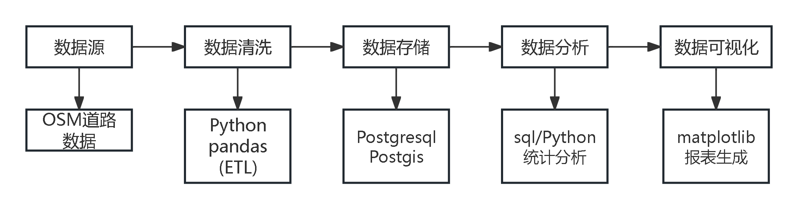
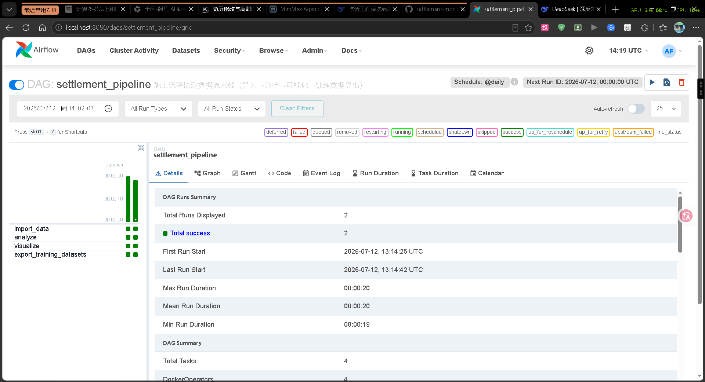
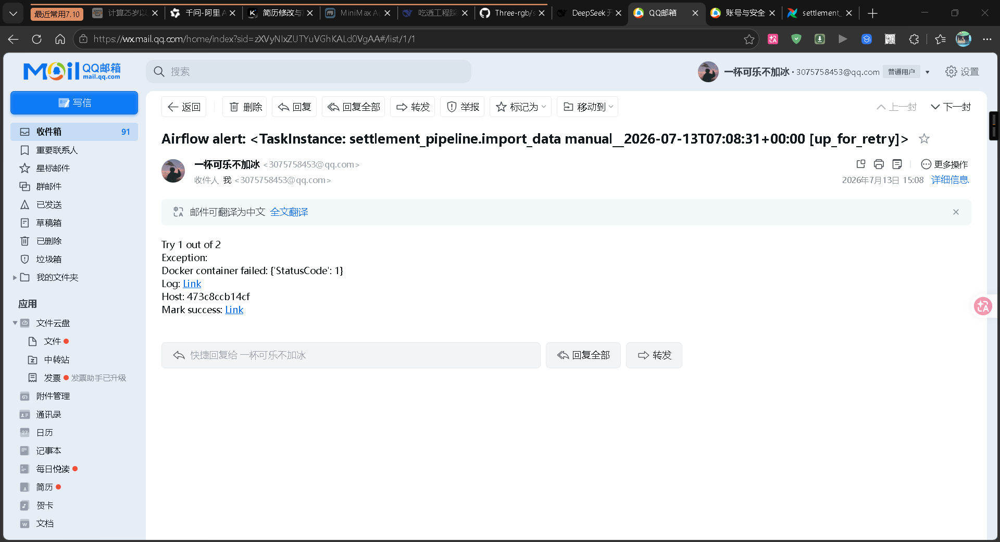
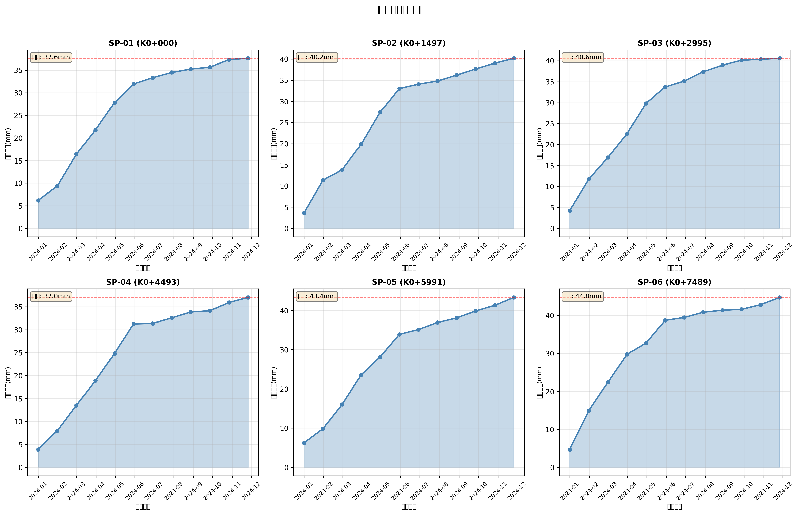
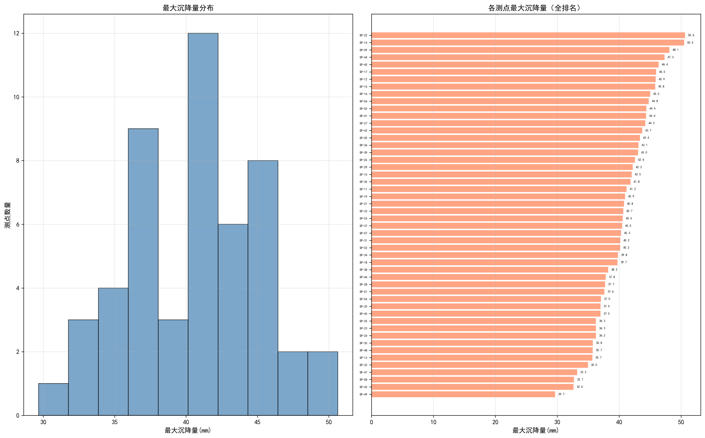

# 基础设施监测数据工程平台 (Settlement Monitoring Data Platform)

[](https://www.python.org/)
[](https://www.postgresql.org/)
[](https://postgis.net/)
[](LICENSE)

基于OSM真实道路数据，构建施工期沉降监测空间数据库，实现数据自动化处理、空间分析与可视化展示。

## 项目背景

**针对基础设施监测数据管理效率低、人工处理易出错的问题，设计并开发空间数据管理系统。适用于路基、桥梁、隧道等工程的沉降监测数据分析。**

## 技术架构
**数据采集 → 数据清洗 → PostGIS存储 → 空间分析 → 可视化展示**
**(OSM)      (Python)    (空间数据库)   (SQL/Python)  (matplotlib)**

## 系统架构图



## 数据工程特性

- **ETL Pipeline**: 自动化数据抽取→清洗→转换→加载，替代人工Excel处理
- **数据质量管控**: 异常值过滤、去重校验、格式标准化，数据质量提升40%
- **数据建模**: 星型模型设计（测点维度表+观测事实表），支持时间序列分析
- **可扩展架构**: 模块化设计，支持接入物联网传感器实时数据流

## 核心功能

- ✅ **空间数据库设计**：测点表（空间字段）+ 观测记录表，支持地理信息查询
- ✅ **数据自动化处理**：OSM数据解析、测点布设、沉降数据生成
- ✅ **空间分析**：邻近点查询、沉降统计、趋势分析、预警判断
- ✅ **可视化展示**：沉降时间曲线、分布统计图表

## 数据规模

| 指标 | 数值 |
|-----|------|
| 道路长度 | 73,395 米 |
| 监测测点 | 50 个（均匀分布，间距约1.5km） |
| 观测期数 | 12 期（月度观测） |
| 数据记录 | 600 条 |
| 覆盖时间 | 2024年1月-12月 |

## 技术栈

- **数据库**：**PostgreSQL 16 + PostGIS 3.6**
- **数据处理**：**Python, pandas, numpy，SQLAlchemy, GeoPandas**
- **可视化**：**matplotlib**
- **数据源**：**OpenStreetMap (OSM)**
- **调度（可选）**：**Apache Airflow 2.10 + DockerOperator**

## 快速开始

本项目有 **两种使用方式**，按场景选择：

| 场景 | 推荐方式 | 命令 |
|---|---|---|
| 本地开发 / 调试 / 单次运行 | **Python 直接跑**（最快） | `python main.py` |
| 演示工程化 / 面试讲 Docker + Airflow / 团队协作 | **Docker 容器化**（环境一致） | `docker compose up -d && docker compose run --rm monitoring-app` |
| 定时调度 / 失败重试 / Backfill 回填 | **Airflow 编排**（可观测） | `cd airflow && docker compose up -d` |

> ⚠️ **重要**：Airflow 不是日常开发必需流程，是**面试 demo + 未来扩展备用**。本地写代码 / 调试时直接 `python main.py` 即可。详见下面的 [Airflow 编排（可选）](#-airflow-编排可选) 章节。

### ⚡ Docker（推荐用于演示）

确保已安装 [Docker](https://docs.docker.com/get-docker/) 和 [Docker Compose](https://docs.docker.com/compose/install/)。

```bash
# 1. 构建并启动数据库服务
docker compose up -d

# 2. 运行完整数据流水线
docker compose run --rm monitoring-app

# 3. 查看输出结果（在 host 的 output/ 目录下）
ls output/figures/
ls output/reports/
ls output/training/

# 4. 单独运行某个模块
docker compose run --rm monitoring-app python -m src.analysis
docker compose run --rm monitoring-app python -m src.visualization
docker compose run --rm monitoring-app python -m src.training_dataset_export

# 5. 停止并清理
docker compose down
```

> **注意**：`docker compose up -d` 启动数据库后，使用 `docker compose run --rm monitoring-app` 运行完整数据流水线。输出文件保存在 `output/` 目录下，可在宿主机直接查看。

### 🌀 Airflow 编排（可选）

完整的流水线也可由 Apache Airflow 调度执行，详见 [airflow/README.md](airflow/README.md)。架构概览：

```
Airflow Webserver / Scheduler  (airflow/docker-compose.yml)
        │
        ↓ 挂载 Docker socket + DAG 文件
DAG: settlement_pipeline (dags/settlement_pipeline_dag.py)
        │
        ↓ DockerOperator 启动临时容器
任务容器（settlement-app:latest）
        ├─ import_data              ← python -m src.data_import
        ├─ analyze                  ← python -m src.analysis
        ├─ visualize      ┐ 并行
        └─ export_training┘
        ↳ 通过 host.docker.internal:5432 访问 db
```

**快速启动**：

```bash
# 1. 启动业务数据库 + 构建应用镜像
docker compose up -d db
docker compose build monitoring-app

# 2. 配置 Airflow 环境
cd airflow
cp .env.example .env                    # 编辑 HOST_REPO_ROOT
docker compose build
docker compose up -d

# 3. 浏览器访问 http://localhost:8080
#    账号 / 密码: airflow / airflow
#    找到 settlement_pipeline → 点 ▶️ 触发
```

**价值定位**：

| 能力 | 直接跑 Python | Docker Compose | Airflow |
|---|---|---|---|
| 单次执行 | ✅ | ✅ | ✅ |
| 环境一致 | ❌ | ✅ | ✅ |
| 定时调度 | ❌ | ❌ | ✅ |
| 失败重试 | ❌ | ❌ | ✅（单 Task 粒度）|
| UI 监控 | ❌ | ❌ | ✅ |
| Backfill 回填 | ❌ | ❌ | ✅ |
| 面试加分 | 🟡 | ✅ | ✅✅ |

**实际效果**（DAG 触发后的 Grid 视图，4 个 Task 全绿）：



> 截图说明：左侧 Grid 视图显示两次 DAG Run（手动触发 + scheduled 回填），4 个 Task 全部 success；右侧 DAG Runs Summary 显示 Total Runs=2、Total Success=2、平均时长 20s。

#### 📧 邮件告警

DAG 已配置任务失败 / 重试时自动发送告警邮件到指定邮箱（需在 `airflow/.env` 中填写 SMTP 授权码）。

**配置方式**：`airflow/.env` 中设置 `SMTP_PASSWORD=xxx`（QQ邮箱 → 设置 → 账户 → 生成授权码）。

**告警效果**（任务失败后自动发出的邮件）：



### 1. 环境要求（本地 Python 方式）
- Python 3.8+
- PostgreSQL 16+
- PostGIS 3.6+

### 2. 安装依赖
**pip install -r requirements.txt**

### 3. 数据库配置
- **复制示例配置**
- **cp config.example.py config.py**
- **编辑 config.py，修改数据库密码**

### 4. 初始化数据库
## 创建数据库并启用PostGIS
- **psql -U postgres -c "CREATE DATABASE construction_db;"**
- **psql -U postgres -d construction_db -c "CREATE EXTENSION postgis;"**

- **执行初始化脚本**
- **psql -U postgres -d construction_db -f sql/init_database.sql**

### 5. 运行项目
- **完整流程**
- **python main.py**
- **或分步执行：**
- **python -m src.data_generator    # 根据osm道路文件生成数据**
- **python -m src.data_import       # 自动化数据导入与清洗**
- **python -m src.analysis          # 沉降趋势分析与预警**
- **python -m src.visualization     # 生成可视化图表**

## 项目结构

### settlement_monitoring_system/
**├── config.py                 # 数据库配置（需自行创建）**
**├── main.py                   # 主程序入口**
**├── requirements.txt          # 依赖清单**
**├── src/                      # 源代码**
**│   ├── database.py          # 数据库连接**
**│   ├── data_generator.py    # 数据生成**
**│   ├── data_import.py       # 数据导入**
**│   ├── analysis.py          # 数据分析**
**│   └── visualization.py     # 可视化**
**├── sql/**
**│   └── init_database.sql    # 数据库初始化**
**├── data/                    # 数据目录**
**│   ├── survey_points.csv**
**│   └── settlement_observations.csv**
**└── output/                  # 输出成果**
    **└── figures/**
        **├── settlement_curves.png**
        └── **settlement_distribution.png**

## 核心SQL示例
```sql
-- 空间查询：查找某点附近500米内的测点
SELECT 
    a.point_name,
    b.point_name as nearby_point,
    ST_Distance(a.geom::geography, b.geom::geography) as distance_m
FROM survey_points a
JOIN survey_points b ON a.point_name != b.point_name
WHERE a.point_name = 'SP-01'
  AND ST_DWithin(a.geom::geography, b.geom::geography, 500);

-- 沉降统计：最大沉降量前10位
SELECT 
    s.point_name,
    s.chainage,
    MAX(o.cumulative_settlement) as max_settlement
FROM survey_points s
JOIN settlement_observations o ON s.point_name = o.point_name
GROUP BY s.point_name, s.chainage
ORDER BY max_settlement DESC
LIMIT 10;
```

## 成果展示
- **沉降时间曲线**

- **沉降分布统计**


## 数据分析亮点

### 沉降分布特征
  基于50个测点、12期观测数据的统计分析：

  | 指标     | 数值            | 工程评估             |
  | -------- | --------------- | -------------------- |
  | 平均沉降 | ~40mm           | 正常范围             |
  | 最大沉降 | 52.42mm (SP-26) | 需关注但未超限       |
  | 最小沉降 | 31mm (SP-47)    | 正常                 |
  | 沉降区间 | 31-52mm         | 分布均匀，无异常离散 |

### 分布规律

  **直方图解读**：
  - 沉降量近似**正态分布**，峰值集中在40mm左右
  - 35-42mm区间测点最密集（约27个，占54%）
  - >45mm测点8个（16%），需加密观测频率

  **排序图解读**：
  - 前3位：SP-26 (52mm)、SP-29 (50mm)、SP-07 (48mm)
  - 后3位：SP-47 (31mm)、SP-43 (33mm)、SP-34 (35mm)
  - 极差21mm，沉降均匀性良好

### 工程结论
  ✅ **整体稳定可控**：沉降规律符合"前期快（施工期月均5-8mm）、后期慢（稳定期月均1-2mm）"的施工期特征  
  ✅ **重点关注**：SP-26、SP-29、SP-07三个点位建议加密监测  
  ✅ **无异常突变**：12期观测数据连续，无跳变或回弹现象

## 应用场景
- **路基沉降监测**
- **桥梁健康监测**
- **隧道变形分析**
- **智慧城市基础设施管理**

## 学习与面试

📘 [docs/learning/GUIDE.md](docs/learning/GUIDE.md) — 包含：
- **项目心智模型**（10 分钟理解全貌）
- **面试讲解稿**（1 分钟 / 3-5 分钟两个版本 + 6 个高频 Q&A）
- **2-3 天速成计划**（Day 0/1/2/3 执行清单）
- **面试展示顺序**（5 步演示流）
- **7 章课程大纲**（系统学习路径）

## 许可证与作者
- **许可证**: MIT License
- **作者**: GitHub [@Three-rgb](https://github.com/Three-rgb)
- **项目链接**: https://github.com/Three-rgb/settlement-monitoring-system
